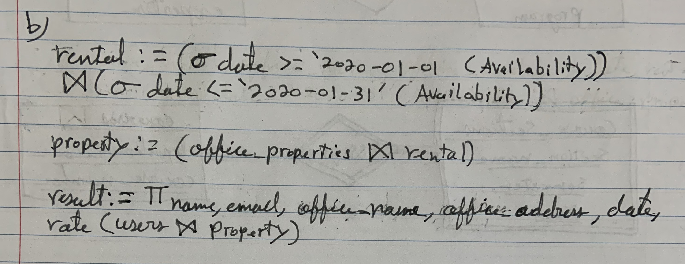

# CSI2532_Devoir1
###nom: Alexander Moussa
###Numero d'étudiant: 300018112

##A1
###a)

###b)

###c)

##A2

##A3
###a)

###b)

##B1
###a)
| name   | experience |
|:------:|:----------:|
| andrew | 2          |
| august | 0          |
| hayden | 1          |

###b)
| name    | released_date |
|:-------:|:-------------:|
| MS Word | 2011-01-20    |
| Sketch  | 2016-06-15    |

###c)
| id | name   | num |
|:--:|:------:|:---:|
| 49 | hayden | 1   |

##B2
###a)
'''
SELECT name
FROM users
WHERE join_date < '2020-01-01';
'''

| name   |
|:------:|
| andrew |
| hayden |

###b)
'''
SELECT name, count(software_name) AS num_licenses
FROM users LEFT JOIN licenses ON users.id = licenses.user_id
GROUP BY name
ORDER BY num_licenses DESC, name ASC;
'''

|  name  | num_licenses |
|:------:|:------------:|
| andrew |       2      |
| august |       1      |
|  ayana |       1      |
| hayden |       1      |

###c)
'''
INSERT INTO licenses (user_id, software_name, access_code) VALUES
(49, 'Sketch', 'abc125'),
(49, 'Chrome', 'def457');
'''

|  name  | num_licenses |
|:------:|:------------:|
| hayden |       3      |
| andrew |       2      |
| august |       1      |
|  ayana |       1      |

###d)
'''
UPDATE softwares
SET version = '51', released_date = '2020-01-01'
WHERE name = 'Sketch';
'''

##B3
###a)
'''
BEGIN;
ALTER TABLE licenses
ADD version varchar(100);
COMMIT;
'''

###b)
'''
BEGIN;
ALTER TABLE softwares
DROP CONSTRAINT softwares_pkey;

ALTER TABLE softwares
ADD CONSTRAINT softwares_pkey PRIMARY KEY (name, version);
COMMIT;
'''

###c)
'''
BEGIN;
ALTER TABLE licenses
DROP CONSTRAINT licenses_pkey;

ALTER TABLE licenses
ADD CONSTRAINT licenses_pkey PRIMARY KEY (user_id, software_name, version);
COMMIT;
'''

###d)
'''
INSERT INTO licenses (user_id, software_name, access_code, version) VALUES
(new_id, new_software, '1monthfree', 52)
UPDATE licenses
ADD version = '52'
WHERE software_name = "Sketch" AND version <> '52';
'''

'''
BEGIN;
TRUNCATE licenses;
 
INSERT INTO licenses (user_id, software_name, access_code, version) VALUES
(48, 'MS Word', 'abc123', 2012),
(49, 'MS Word', 'def456', 2012),
(50, 'MS Word', 'hij789', 2020),
(48, 'Sketch', 'x1y2z3', 49),
(51, 'Sketch', 'x2y3z4', 49),
(49, 'Sketch', 'abc125', 52),
(49, 'Chrome', 'def457', 'v92'),
(48, 'Sketch', 'xxxyyy111', 52);
COMMIT;
'''

